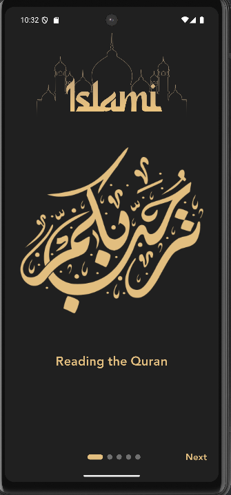
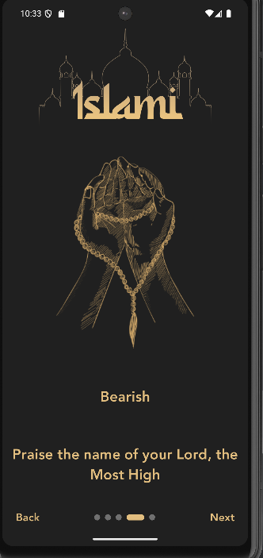
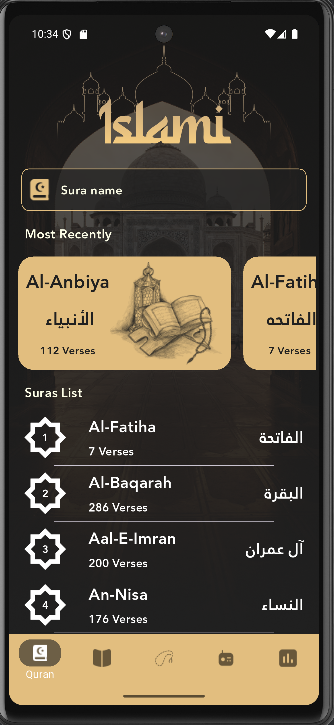
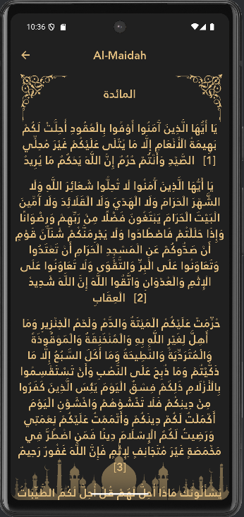
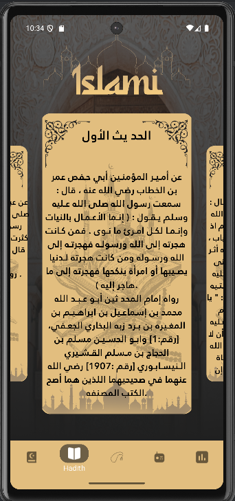
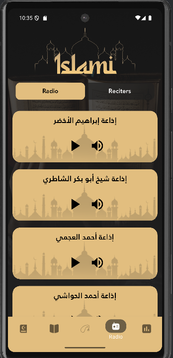
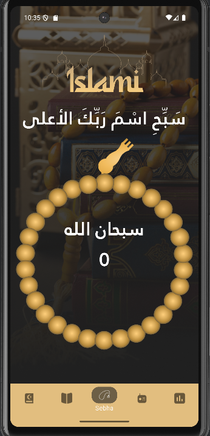
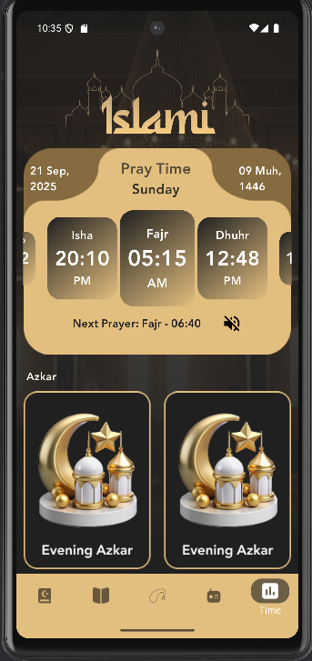

# 🕌 Islamic App

A comprehensive Flutter application designed for Muslims to read the Quran, explore Hadith, listen to Quran recitations, perform Tasbih (Dhikr), and track prayer times with Adhan notifications. The app features a clean, user-friendly interface built with modern Flutter architecture patterns.

## ✨ Features

### 📖 Quran Reading
- **Complete Quran Text** - Read all 114 Surahs with Arabic text
- **Surah Details** - Detailed view of each Surah with verses
- **Recent Reading** - Track your recent Quran reading progress
- **Beautiful Typography** - Custom Arabic fonts for better readability
- **Search Functionality** - Find specific verses or Surahs quickly

### 📚 Hadith Collection
- **Authentic Hadith** - Collection of authentic Islamic traditions
- **Categorized Content** - Organized Hadith by topics and themes
- **Easy Navigation** - Browse through different Hadith collections
- **Offline Access** - Read Hadith without internet connection

### 📻 Quran Radio
- **Live Recitations** - Listen to Quran recitations from famous reciters
- **Multiple Reciters** - Choose from various renowned Quran reciters
- **High Quality Audio** - Crystal clear audio streaming
- **Background Playback** - Continue listening while using other apps

### 📿 Tasbih (Dhikr) Counter
- **Digital Tasbih** - Count your Dhikr and Tasbih digitally
- **Beautiful Design** - Elegant interface with Islamic-themed graphics
- **Reset Functionality** - Easy reset to start counting again
- **Visual Feedback** - Smooth animations and visual cues

### 🕌 Prayer Times & Adhan
- **Accurate Prayer Times** - Get precise prayer times for your location
- **Adhan Notifications** - Receive Adhan alerts for each prayer
- **Location-Based** - Automatically detects your location for accurate times
- **Multiple Locations** - Support for different cities and countries

## Screenshots

### App Introduction & Onboarding
| Introduction Screen 1                    | Introduction Screen 2                    |
|------------------------------------------|------------------------------------------|
|  |  |

### Main Features
| Quran Tab                                | Quran Details                            |
|------------------------------------------|------------------------------------------|
|  |  |

| Hadith Tab                               | Radio Reciters                           |
|------------------------------------------|------------------------------------------|
|  |  |

| Tasbih (Sebha)                           | Prayer Times                             |
|------------------------------------------|------------------------------------------|
|  |  |

## 🛠️ Technical Features

### 🏗️ Architecture & State Management
- **Clean Architecture** - Separation of concerns with layered architecture
- **Cubit State Management** - Reactive state management with Flutter Bloc
- **Dependency Injection** - Injectable for automatic dependency injection
- **API Client** - Centralized API communication layer
- **Retrofit** - Type-safe HTTP client for API calls

### 📊 Data Management
- **Local File Reading** - Quran and Hadith content stored locally
- **API Integration** - Prayer times and radio data from external APIs
- **Offline Support** - Core features work without internet connection
- **Shared Preferences** - User settings and preferences storage

### 🎨 UI/UX Features
- **Modern Design** - Clean and intuitive Islamic-themed interface
- **Smooth Animations** - Enhanced user experience with Animate Do
- **Responsive Layout** - Optimized for all screen sizes
- **Custom Fonts** - Beautiful Arabic typography with Janna font family
- **Carousel Navigation** - Smooth page transitions and indicators

### 🔊 Audio Features
- **Just Audio Integration** - High-quality audio streaming
- **Background Playback** - Continue listening while multitasking
- **Audio Session Management** - Proper audio handling and controls

## 🚀 Getting Started

### Prerequisites
- Flutter SDK (>=3.2.1)
- Dart SDK
- Android Studio / VS Code
- Git

### Installation

1. **Clone the repository**
   ```bash
   git clone https://github.com/yourusername/islamic-app.git
   cd islamic-app
   ```

2. **Install dependencies**
   ```bash
   flutter pub get
   ```

3. **Generate code**
   ```bash
   flutter packages pub run build_runner build
   ```

4. **Run the app**
   ```bash
   flutter run
   ```

## 📱 App Structure

```
lib/
├── core/                 # Core functionality
│   ├── constants/        # App constants and API endpoints
│   ├── di/              # Dependency injection setup
│   ├── extensions/      # Dart extensions and utilities
│   ├── routes/          # Navigation routes
│   ├── theme/           # App theming and colors
│   └── widgets/         # Reusable widgets
├── features/            # Feature modules
│   ├── splash/          # Splash screen
│   ├── onboarding/      # Introduction screens
│   └── layout/          # Main app layout
│       ├── models/      # Data models
│       └── presentation/
│           ├── screens/ # Feature screens
│           │   ├── quran/        # Quran reading features
│           │   ├── hadith/       # Hadith collection
│           │   ├── radio/        # Quran radio streaming
│           │   ├── sebha/        # Tasbih counter
│           │   └── time/         # Prayer times
│           └── widgets/ # Feature-specific widgets
└── main.dart           # App entry point
```

## 🔧 Key Dependencies

### Architecture & State Management
- `flutter_bloc` - Cubit state management
- `injectable` - Dependency injection
- `get_it` - Service locator for dependency injection
- `dartz` - Functional programming utilities

### API & Networking
- `retrofit` - Type-safe HTTP client
- `dio` - HTTP client for API calls
- `json_annotation` - JSON serialization

### Audio & Media
- `just_audio` - Audio streaming and playback
- `audio_session` - Audio session management

### UI & Animations
- `animate_do` - Smooth animations
- `carousel_slider` - Carousel functionality
- `smooth_page_indicator` - Page indicators

### Local Storage & Utilities
- `shared_preferences` - Local storage
- `intl` - Internationalization and formatting
- `logger` - Logging utilities

### Development Tools
- `injectable_generator` - Code generation for dependency injection
- `json_serializable` - JSON serialization code generation
- `retrofit_generator` - Retrofit code generation
- `build_runner` - Code generation runner

## 🎯 Features in Detail

### Quran Reading Experience
- **Complete Text** - All 114 Surahs with proper Arabic formatting
- **Verse Navigation** - Easy navigation between verses
- **Reading Progress** - Track your reading journey
- **Search Functionality** - Find specific verses or topics
- **Beautiful Typography** - Custom Arabic fonts for readability

### Hadith Collection
- **Authentic Sources** - Carefully curated authentic Hadith
- **Topic Organization** - Hadith organized by Islamic topics
- **Easy Reading** - Clean interface for comfortable reading
- **Offline Access** - Read without internet connection

### Quran Radio Streaming
- **Live Recitations** - Stream Quran recitations in real-time
- **Famous Reciters** - Access to renowned Quran reciters
- **High Quality** - Crystal clear audio streaming
- **Background Play** - Continue listening while using other apps

### Digital Tasbih
- **Accurate Counting** - Digital counter for Dhikr and Tasbih
- **Beautiful Interface** - Islamic-themed design
- **Easy Reset** - Quick reset functionality
- **Visual Feedback** - Smooth animations and transitions

### Prayer Times & Adhan
- **Accurate Timing** - Precise prayer times based on location
- **Adhan Alerts** - Notifications for each prayer time
- **Location Services** - Automatic location detection
- **Multiple Cities** - Support for various locations worldwide

## 🌟 App Highlights

- **Offline-First Design** - Core features work without internet
- **Clean Architecture** - Maintainable and scalable codebase
- **Modern UI/UX** - Beautiful and intuitive interface
- **Performance Optimized** - Smooth performance across devices
- **Accessibility** - Designed with accessibility in mind
- **Localization Ready** - Prepared for multiple languages

## 🤝 Contributing

1. Fork the project
2. Create your feature branch (`git checkout -b feature/AmazingFeature`)
3. Commit your changes (`git commit -m 'Add some AmazingFeature'`)
4. Push to the branch (`git push origin feature/AmazingFeature`)
5. Open a Pull Request


## 👨‍💻 Authors
Mohamed Yasser

**Your Name**
- This project was developed as a comprehensive Islamic application for Muslims worldwide

## 🙏 Acknowledgments

- Flutter team for the amazing framework
- Islamic scholars for authentic content
- Open source community for inspiration
- All contributors who helped make this project possible

---

**May Allah bless this project and make it beneficial for all Muslims worldwide. Ameen. 🤲**